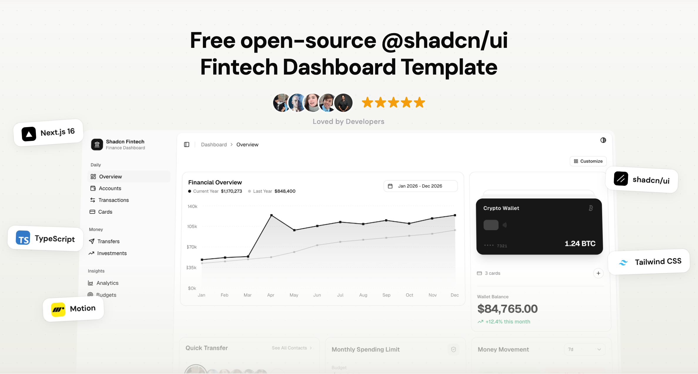

<div align="center">

# Shadcn Fintech

A premium, open-source fintech dashboard built with Next.js, shadcn/ui, and Tailwind CSS.

[](https://github.com/abderrahimghazali/shadcn-fintech/actions/workflows/ci.yml)
[](LICENSE)
[](https://nextjs.org)
[](https://ui.shadcn.com)
[](https://tailwindcss.com)
[](https://typescriptlang.org)

[Demo](https://shadcn-fintech.vercel.app) · [Report Bug](https://github.com/abderrahimghazali/shadcn-fintech/issues) · [Request Feature](https://github.com/abderrahimghazali/shadcn-fintech/issues)



</div>

## Features

- **10 fully built pages** — Dashboard, Accounts, Transactions, Transfers, Cards, Analytics, Investments, Budgets, Settings, Notifications
- **Drag-and-drop dashboard** — Rearrange widgets with dnd-kit, persisted to localStorage
- **Interactive credit cards** — 3D flip animation, freeze toggle, virtual card generator
- **Live investment ticker** — Simulated real-time price updates with flash animations
- **Spending heatmap** — GitHub-style 365-day calendar visualization
- **Actionable notifications** — Accept/decline money requests and device authorization inline
- **Smart analytics** — Category drill-down donuts, recurring charge detector, AI insights
- **Budget tracking** — Animated SVG progress rings, savings goals, month projection
- **Quick transfers** — Contact selector with send simulation
- **Dark mode** — Full dark/light/system theme support
- **Responsive** — Works on desktop, tablet, and mobile

## Pages

| Page | Description |
|------|-------------|
| `/dashboard` | Financial overview, wallet cards, quick transfer, spending limit, money movement |
| `/accounts` | Linked bank accounts with balances, add account flow |
| `/transactions` | Searchable table with filters, expandable rows, bulk CSV export |
| `/transfers` | Send/receive/scheduled transfers with stats and quick send |
| `/cards` | 3D flip card, freeze/unfreeze, spending controls, virtual card creator |
| `/analytics` | Spending heatmap, category breakdown, recurring charges, AI insights |
| `/investments` | Portfolio allocation, holdings with sparklines, live ticker, watchlist |
| `/budgets` | Budget rings, savings goals, spending calendar, month projection |
| `/settings` | Profile, security, notifications, billing, appearance |
| `/notifications` | Filterable notification feed with dismiss animations |

## Tech Stack

| | Technology |
|---|---|
| Framework | [Next.js 16](https://nextjs.org) (App Router) |
| UI | [shadcn/ui](https://ui.shadcn.com) |
| Styling | [Tailwind CSS v4](https://tailwindcss.com) |
| Charts | [Recharts](https://recharts.org) |
| Animations | [Motion](https://motion.dev) |
| Drag & Drop | [@dnd-kit](https://dndkit.com) |
| Icons | [Lucide React](https://lucide.dev) |
| Language | TypeScript |

## Getting Started

```bash
git clone https://github.com/abderrahimghazali/shadcn-fintech.git
cd shadcn-fintech
pnpm install
pnpm dev
```

Open [http://localhost:3000](http://localhost:3000) to see the dashboard.

## Customization

**Theme** — Edit `src/app/globals.css` to customize colors. Full dark mode support via CSS variables.

**Mock Data** — All demo data lives in `src/data/seed.ts`. Replace with your own data or connect to a real API.

**Dashboard Layout** — Click "Customize" on the dashboard to drag and rearrange widgets. Persists to localStorage.

## Sponsor this project

If you find this useful, consider supporting the development:

<a href="https://github.com/sponsors/abderrahimghazali">
  
</a>
<a href="https://buymeacoffee.com/abderrahimghazali">
  
</a>

## License

MIT - see [LICENSE](LICENSE) for details.

## Author

**Abderrahim Ghazali** — [@abderrahimghazali](https://github.com/abderrahimghazali)
